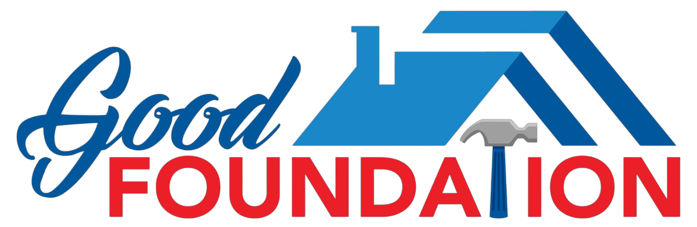

Good Foundation🏗️
=================

   

Craftsmanship in Construction
-----------------------------

Embark on a construction journey with Good Foundation, where every project is a testament to craftsmanship, durability, and the art of construction. We leverage modern technologies to build spaces that stand the test of time, ensuring quality and attention to detail.

**Features** we offer: **Personalized Consultation**, **Expert Construction**, **Innovative Designs**, **Durability Assurance**, and **Timely Delivery**

Technologies Used
-----------------

Good Foundation is built with cutting-edge technologies to ensure efficiency, reliability, and innovation. Our tech stack includes:

### Core Technologies

*   [React.js](https://reactjs.org) - **17.0.2**
*   [Node.js](https://nodejs.org) - **14.17.6**
*   [Tailwind CSS](https://tailwindcss.com) - **3.1.8**

### Version Control

*   [GitHub](https://github.com)

### Deployment

*   [FireBase](https:/firebase.google.com)

### CI/CD

*   [GitHub Actions](https://github.com/features/actions)

### Design Collaboration

*   [Figma](https://www.figma.com)

### Project Management

*   [Jira](https://www.atlassian.com/software/jira)

### Collaboration and Communication

*   [Slack](https://slack.com)

### Other Dependencies

*   [Eslint](https://eslint.org)
*   [Prettier](https://prettier.io)

Explore Our Work
----------------

Good Foundation Showcase: [https://projects.goodfoundation.co](https://projects.goodfoundation.co)

Project Portfolio
-----------------

Good Foundation Portfolio: [https://portfolio.goodfoundation.co](https://portfolio.goodfoundation.co)

Getting Started with Good Foundation
------------------------------------

Discover our construction process: [https://goodfoundation.co/getting-started](https://goodfoundation.co/getting-started)

Showcase Your Vision with Good Foundation
-----------------------------------------

[](https://goodfoundation.co/new-project?repository-url=https%3A%2F%2Fgithub.com%2Fgoodfoundation%2Fgoodfoundation&env=PROJECT_TYPE,CONSTRUCTION_DETAILS,BUDGET_RANGE,CONTACT_EMAIL,CONTACT_PHONE&project-name=goodfoundation&repo-name=goodfoundation&demo-title=GoodFoundation%20-%20Crafting%20Your%20Vision&demo-description=GoodFoundation%20is%20dedicated%20to%20bringing%20your%20construction%20visions%20to%20life,%20combining%20craftsmanship,%20innovation,%20and%20reliability.&demo-url=https%3A%2F%2Fprojects.goodfoundation.co&demo-image=https%3A%2F%2Fgoodfoundation.co%2Fimages%2Fseo-cover.png)

Explore our portfolio for inspiration and showcase your vision with Good Foundation.

Exceptional Projects
--------------------

*   🏠 Residential Construction
*   🏢 Commercial Buildings
*   🏫 Educational Institutions
*   🏥 Healthcare Facilities
*   🏛 Historical Restoration
*   🏗️ Infrastructure Development
*   🌳 Green and Sustainable Projects
*   🏘️ Community Development

Craftsmanship in Every Detail
-----------------------------

### Primary

*   [Innovative Designs](https://goodfoundation.co/designs) - **2023 Edition**
*   [Quality Construction](https://goodfoundation.co/construction) - **Proven Excellence**
*   [Reliable Project Management](https://goodfoundation.co/project-management) - **On-Time Delivery**
*   [Sustainable Practices](https://goodfoundation.co/sustainability) - **Eco-Friendly Solutions**

